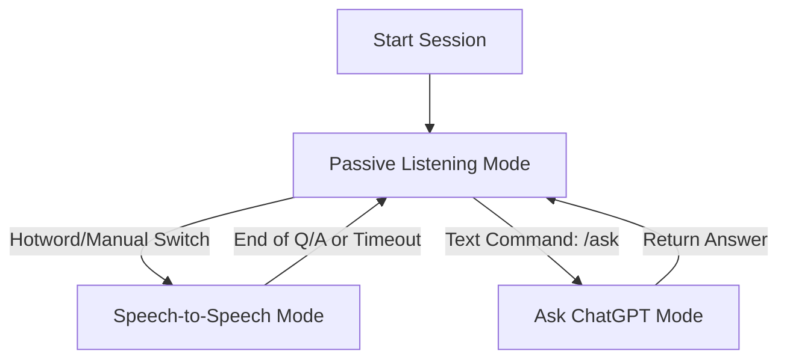

# PRD: AI Podcast Co-Host – Split Stack Architecture

## Overview
The goal is to optimize **cost**, **latency**, and **efficiency** for a podcast AI co-host.  
We will implement a **Split Stack** approach with three operational modes:

1. **Passive Listening (Transcription-Only Mode)** – Uses STT for transcription only, minimal processing cost.
2. **Speech-to-Speech Interaction Mode** – Uses STT for question capture + TTS for spoken responses.
3. **Ask ChatGPT Mode** – Text-only Q&A for fast, cost-efficient, non-verbal queries (no audio in/out, no media generation).

---

## Design Principles
- **Optimize for low latency**: Direct streaming for active voice segments, batch transcription for passive listening.
- **Cost control**: Use cheaper STT models (e.g., `gpt-4o-mini-transcribe`) for transcription.  
  Only trigger TTS when speech is explicitly requested.
- **Session-awareness**: Maintain per-session cost tracking via a cost calculator widget.
- **Claude Code CLI compatibility**: Flow logic defined clearly for CLI automation and testing.

---

## Operational Modes

### 1. Passive Listening (Default State)
**Intent:** Transcribe the podcast audio in real-time or near-real-time without generating a spoken response.

**API Path:**
- Input: Audio stream (mono, 16 kHz)
- API: `gpt-4o-mini-transcribe` (fast, low-cost STT)
- Output: Text transcript (stored + optionally sent to summarization endpoint)
- Latency Target: < 1.5s from audio chunk to text

**Triggers to Exit Mode:**
- User activates “Speech-to-Speech” mode manually
- Hotword detected (“Hey Co-Host” or similar)
- Host sends `/ask` command to chatbot

---

### 2. Speech-to-Speech Interaction Mode
**Intent:** Engage in verbal back-and-forth with minimal delay while continuing transcription for records.

**API Path:**
1. **STT** – Transcribe host’s spoken question using `gpt-4o-mini-transcribe`.
2. **Text Reasoning** – Send transcript to `gpt-4o` (or `gpt-5` when accuracy matters) for reasoning and response generation.
3. **TTS** – Convert text response to speech using `gpt-4o-mini-tts` or similar low-latency TTS.
4. **Logging** – Store both Q & A in session transcript.

**Latency Target:**
- Question STT: < 1.5s
- Reasoning: < 2.0s
- TTS output start: < 0.8s after reasoning complete

**Cost Controls:**
- Keep responses concise unless elaboration requested
- Implement silence detection (VAD) to end TTS early if host interrupts

---

### 3. Ask ChatGPT Mode (Text-Only)
**Intent:** Provide quick factual answers to direct user questions without any audio processing.

**API Path:**
- Input: Text prompt from host (CLI or UI)
- API: `gpt-4o-mini` (low latency, low cost)
- Optional: Use `web_search` flag for quick factual lookup
- Output: Plain text
- No transcription, no TTS

**Latency Target:**
- < 1.0s for local reasoning
- < 1.5s with optional web search

**Cost Controls:**
- Keep max tokens low (e.g., 256) unless explicitly expanded
- Skip embeddings or vector lookups unless requested

---

## Flow Logic



---

## Claude Code CLI Execution Logic

### CLI Command Mappings
- **Default** → Passive Listening
- `--s2s` → Enter Speech-to-Speech mode  
- `--ask "<question>"` → Run Ask ChatGPT mode  
- `--cost` → Display session cost

### Mode Switching
```pseudo
if mode == PASSIVE:
    run STT_stream()
elif mode == SPEECH2SPEECH:
    run STT_once()
    run GPT_reason()
    run TTS_output()
elif mode == ASK:
    run GPT_quick()
```

---

## API Cost Calculator Update

**Goal:** Track total cost per session by summing usage across:
- STT requests (per minute of audio)
- Text reasoning tokens
- TTS output (per minute of audio generated)

**Pseudocode:**
```python
class CostTracker:
    def __init__(self):
        self.stt_minutes = 0
        self.tts_minutes = 0
        self.tokens_in = 0
        self.tokens_out = 0

    def add_stt(self, minutes, rate_per_min):
        self.stt_minutes += minutes
        return minutes * rate_per_min

    def add_tts(self, minutes, rate_per_min):
        self.tts_minutes += minutes
        return minutes * rate_per_min

    def add_tokens(self, in_tokens, out_tokens, rate_per_1k_in, rate_per_1k_out):
        self.tokens_in += in_tokens
        self.tokens_out += out_tokens
        return (in_tokens/1000)*rate_per_1k_in + (out_tokens/1000)*rate_per_1k_out

    def session_total(self):
        return self.add_stt(...) + self.add_tts(...) + self.add_tokens(...)
```

**Display Example:**
```
Session Cost Summary:
  STT: 12 min @ $0.006/min = $0.072
  TTS: 4 min @ $0.024/min = $0.096
  Tokens: 8k in, 10k out = $0.048
TOTAL = $0.216
```

---

## Performance & Cost Guidelines
- Always run in **Passive Listening** unless explicitly told to switch
- Use `gpt-4o-mini-transcribe` for STT in both Passive and S2S modes
- Use `gpt-4o-mini` for Ask ChatGPT unless higher reasoning needed
- Use silence gating and token caps to prevent runaway costs

---

## Success Metrics
- **Latency**: < 1.5s Passive STT, < 4s full Speech-to-Speech round trip
- **Cost Efficiency**: ≥ 30% cheaper than always-on Realtime pipeline
- **Transcription Accuracy**: WER ≤ 8% in clean audio conditions
- **Mode Stability**: < 0.5% accidental mode switches

---
